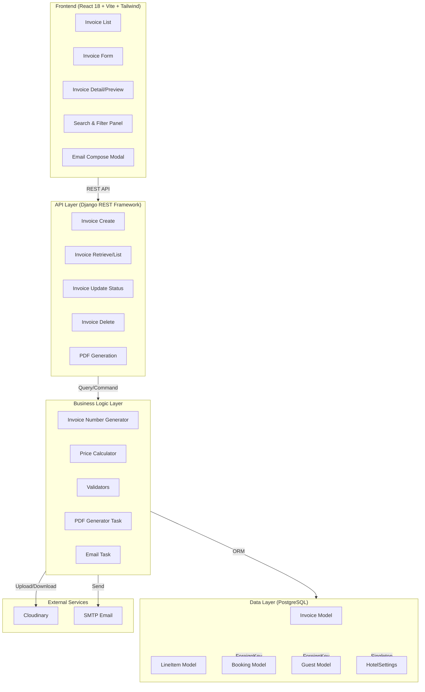
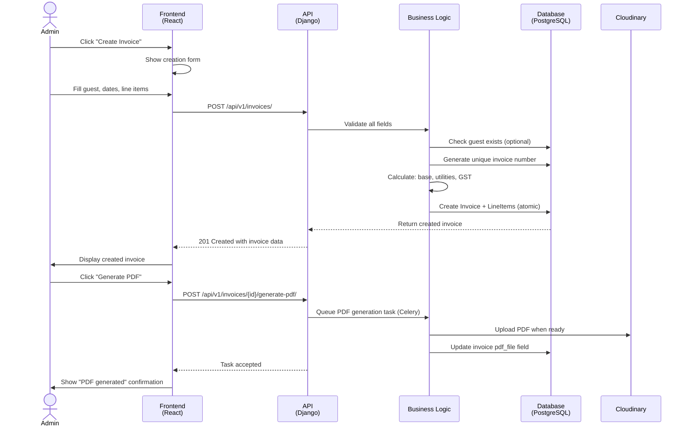

# Design Document: Invoice Management Tab for RBMS Admin Dashboard

## Overview

The Invoice Management system extends the RBMS admin dashboard with comprehensive invoice lifecycle management. The design follows a layered architecture with clear separation between frontend (React), API (Django REST), business logic, and data persistence (PostgreSQL). Invoice numbers are generated atomically with a unique INV-HHMMSS-NNNNN format, calculations are performed deterministically with proper tax and discount handling, and the system maintains immutable audit trails after invoice generation.

### Key Design Goals

1. **Atomic Invoice Number Generation**: Prevent race conditions during concurrent invoice creation
2. **Immutable Audit Trail**: Once "Generated", invoice data becomes read-only
3. **Deterministic Calculations**: All price calculations are reproducible and testable
4. **Scalable Filtering**: Support efficient searches across 10,000+ invoices
5. **Round-Trip Property**: Parser/printer can serialize and deserialize without data loss

---

## Architecture



### Data Flow: Invoice Creation Workflow



---

## Components and Interfaces

### Frontend Components

#### Component Hierarchy

```
InvoiceManagementModule
├── InvoiceListView
│   ├── InvoiceTable
│   │   ├── InvoiceRow
│   │   └── Pagination
│   ├── FilterPanel
│   │   ├── StatusFilter
│   │   ├── DateRangeFilter
│   │   ├── GuestNameSearch
│   │   └── AmountRangeFilter
│   └── Actions
│       ├── CreateButton
│       └── ExportButton
├── InvoiceCreateForm
│   ├── Section1: GuestDetailsForm
│   │   ├── GuestSelector (dropdown)
│   │   └── ManualGuestForm (conditional)
│   ├── Section2: BookingDetailsForm
│   │   ├── DatePicker (check-in, check-out)
│   │   ├── DurationDisplay (auto-calculated)
│   │   └── RoomSelector
│   ├── Section3: LineItemsForm
│   │   ├── LineItemTable
│   │   ├── AddLineItemButton
│   │   └── UtilitiesCalculator
│   ├── Section4: PriceBreakdown (read-only)
│   │   └── BreakdownDisplay
│   └── FormActions
│       ├── SaveDraftButton
│       ├── GenerateButton
│       └── CancelButton
├── InvoiceDetailView
│   ├── InvoiceHeader
│   ├── GuestSection
│   ├── HotelSection
│   ├── BookingDetailsSection
│   ├── LineItemsTable
│   ├── PriceBreakdown
│   └── Actions
│       ├── PrintButton
│       ├── EmailButton
│       ├── StatusUpdateDropdown
│       └── DeleteButton (draft only)
└── EmailComposeModal
    ├── RecipientField
    ├── SubjectField
    ├── BodyEditor
    ├── AttachmentPreview
    └── SendButton
```

#### Key Component Interfaces

**InvoiceListView Props**
```typescript
interface InvoiceListViewProps {
  invoices: InvoiceSummary[];
  filters: FilterState;
  onFilterChange: (filters: FilterState) => void;
  onInvoiceSelect: (invoiceId: string) => void;
  onCreateNew: () => void;
  pagination: PaginationMeta;
  onPageChange: (page: number) => void;
}

interface FilterState {
  status?: 'Draft' | 'Generated' | 'Paid' | 'Archived';
  guestName?: string;
  fromDate?: string; // YYYY-MM-DD
  toDate?: string;   // YYYY-MM-DD
  minAmount?: number;
  maxAmount?: number;
}

interface InvoiceSummary {
  invoiceId: string;
  invoiceNumber: string;
  guestName: string;
  totalAmount: number;
  status: 'Draft' | 'Generated' | 'Paid' | 'Archived';
  issueDate: string; // ISO 8601
}
```

**InvoiceCreateForm State (Zustand)**
```typescript
interface InvoiceFormState {
  // Guest section
  selectedGuestId?: string;
  guestName: string;
  guestEmail: string;
  guestPhone: string;
  guestAddress: string;
  
  // Booking section
  checkInDate: string; // YYYY-MM-DD
  checkOutDate: string;
  durationNights: number; // auto-calculated
  selectedRoomId?: string;
  roomName: string;
  
  // Utilities section
  lineItems: LineItem[];
  autoCalculateUtilities: boolean;
  utilitiesAmount: number;
  baseAmount: number; // room_base_price * nights
  
  // Discount and tax
  discountAmount: number;
  taxAmount: number;
  totalAmount: number;
  
  // State management
  currentSection: 1 | 2 | 3 | 4;
  errors: Record<string, string>;
  isSubmitting: boolean;
  
  // Actions
  setGuestDetails: (details: GuestDetails) => void;
  setBookingDetails: (details: BookingDetails) => void;
  addLineItem: (item: LineItem) => void;
  removeLineItem: (index: number) => void;
  updateLineItem: (index: number, item: LineItem) => void;
  calculateTotals: () => void;
  submitForm: () => Promise<void>;
}

interface LineItem {
  description: string;
  quantity: number;
  unitPrice: number;
  lineTotal: number; // quantity * unitPrice
}
```

**InvoiceDetailView Props**
```typescript
interface InvoiceDetailViewProps {
  invoice: Invoice;
  onStatusChange: (newStatus: string) => void;
  onPrint: () => void;
  onGeneratePDF: () => Promise<void>;
  onEmail: () => void;
  onDelete: () => Promise<void>;
  onBack: () => void;
}

interface Invoice {
  invoiceId: string;
  invoiceNumber: string;
  status: 'Draft' | 'Generated' | 'Paid' | 'Archived';
  issueDate: string;
  statusChangedAt?: string;
  
  // Guest snapshot
  guestName: string;
  guestEmail: string;
  guestPhone: string;
  guestAddress: string;
  
  // Hotel info
  hotelName: string;
  hotelAddress: string;
  hotelPhone: string;
  hotelEmail: string;
  
  // Booking snapshot
  checkIn: string;
  checkOut: string;
  nights: number;
  roomDetails: string;
  
  // Line items
  lineItems: LineItem[];
  
  // Calculations
  baseAmount: number;
  utilitiesAmount: number;
  subtotal: number;
  discountAmount: number;
  taxableAmount: number;
  taxRate: number;
  taxAmount: number;
  totalAmount: number;
  
  // File reference
  pdfUrl?: string;
}
```

### State Management (Zustand)

**Store Structure**
```typescript
// store/invoiceStore.ts
interface InvoiceStore {
  // List state
  invoices: Invoice[];
  filters: FilterState;
  currentPage: number;
  pageSize: number;
  totalCount: number;
  isLoading: boolean;
  
  // Detail state
  selectedInvoice: Invoice | null;
  
  // Form state
  formState: InvoiceFormState;
  
  // Actions
  fetchInvoices: (filters: FilterState, page: number) => Promise<void>;
  fetchInvoiceDetail: (invoiceId: string) => Promise<void>;
  createInvoice: (data: InvoiceCreatePayload) => Promise<Invoice>;
  updateInvoiceStatus: (invoiceId: string, newStatus: string) => Promise<void>;
  deleteInvoice: (invoiceId: string) => Promise<void>;
  generatePDF: (invoiceId: string) => Promise<void>;
  
  // Form actions
  initializeForm: () => void;
  resetForm: () => void;
  updateFormSection: (section: number, data: any) => void;
  validateForm: () => boolean;
}
```

---

## Data Models

### Invoice Model (Extended)

```python
# bookings/models.py (NEW: InvoiceV2 or extend Invoice)

from django.db import models
from django.utils import timezone
from decimal import Decimal

class Invoice(models.Model):
    """
    Comprehensive invoice record for room rental and services.
    Once status moves from 'Draft', all data becomes immutable (audit trail).
    """
    
    class InvoiceStatus(models.TextChoices):
        DRAFT = 'Draft', 'Draft'
        GENERATED = 'Generated', 'Generated'
        PAID = 'Paid', 'Paid'
        ARCHIVED = 'Archived', 'Archived'
    
    # Unique identifier (immutable after creation)
    invoice_number = models.CharField(
        max_length=20,
        unique=True,
        editable=False,
        db_index=True,
        help_text="Format: INV-HHMMSS-NNNNN"
    )
    
    # Status and lifecycle
    invoice_status = models.CharField(
        max_length=20,
        choices=InvoiceStatus.choices,
        default=InvoiceStatus.DRAFT,
        db_index=True
    )
    
    # Optional reference to booking (null for manual invoices)
    booking = models.OneToOneField(
        'bookings.Booking',
        on_delete=models.SET_NULL,
        null=True,
        blank=True,
        related_name='invoice'
    )
    
    # --- Guest Information (Immutable Snapshot) ---
    guest_name = models.CharField(max_length=255)
    guest_email = models.EmailField()
    guest_phone = models.CharField(max_length=20)
    guest_address = models.TextField()
    
    # --- Booking Information (Immutable Snapshot) ---
    check_in = models.DateField()
    check_out = models.DateField()
    nights = models.PositiveIntegerField()
    room_details = models.CharField(max_length=255, help_text="Room name/number and base price")
    
    # --- Pricing (Immutable Snapshot) ---
    base_amount = models.DecimalField(
        max_digits=10,
        decimal_places=2,
        help_text="Room rental: base_price * nights"
    )
    utilities_amount = models.DecimalField(
        max_digits=10,
        decimal_places=2,
        default=Decimal('0.00'),
        help_text="Services and utilities charges"
    )
    discount_amount = models.DecimalField(
        max_digits=10,
        decimal_places=2,
        default=Decimal('0.00')
    )
    
    # Taxable = base + utilities - discount
    taxable_amount = models.DecimalField(
        max_digits=10,
        decimal_places=2,
        help_text="Calculated: (base + utilities - discount)"
    )
    
    # Tax rate (immutable, from HotelSettings at time of invoice creation)
    tax_rate = models.DecimalField(
        max_digits=5,
        decimal_places=2,
        help_text="Percentage (e.g., 18.00 for 18%)"
    )
    
    # Tax amount (immutable)
    tax_amount = models.DecimalField(
        max_digits=10,
        decimal_places=2,
        help_text="Calculated: taxable_amount * (tax_rate / 100)"
    )
    
    # Total = taxable + tax
    total_amount = models.DecimalField(
        max_digits=10,
        decimal_places=2,
        help_text="Calculated: taxable_amount + tax_amount"
    )
    
    # --- PDF and Tracking ---
    pdf_file = models.FileField(
        upload_to='invoices/%Y/%m/',
        null=True,
        blank=True,
        storage=CloudinaryStorage(),
        help_text="Generated PDF file (stored in Cloudinary)"
    )
    
    # --- Audit Trail ---
    created_at = models.DateTimeField(auto_now_add=True, db_index=True)
    updated_at = models.DateTimeField(auto_now=True)
    status_changed_at = models.DateTimeField(
        null=True,
        blank=True,
        help_text="Timestamp of last status transition"
    )
    
    class Meta:
        ordering = ['-created_at']
        indexes = [
            models.Index(fields=['invoice_status', '-created_at']),
            models.Index(fields=['guest_name']),
            models.Index(fields=['created_at']),
        ]
    
    def __str__(self):
        return f"Invoice {self.invoice_number} ({self.guest_name})"
    
    def is_draft(self):
        return self.invoice_status == self.InvoiceStatus.DRAFT
    
    def is_editable(self):
        """Only Draft invoices can be edited"""
        return self.is_draft()
    
    def can_transition_to(self, new_status):
        """Validate status transitions"""
        valid_transitions = {
            self.InvoiceStatus.DRAFT: [
                self.InvoiceStatus.GENERATED,
                self.InvoiceStatus.ARCHIVED,
            ],
            self.InvoiceStatus.GENERATED: [
                self.InvoiceStatus.PAID,
                self.InvoiceStatus.ARCHIVED,
            ],
            self.InvoiceStatus.PAID: [
                self.InvoiceStatus.ARCHIVED,
            ],
            self.InvoiceStatus.ARCHIVED: [],
        }
        return new_status in valid_transitions.get(self.invoice_status, [])
```

### LineItem Model (NEW)

```python
class LineItem(models.Model):
    """
    Utilities and services line items for an invoice.
    Each line item contributes to utilities_amount.
    """
    
    invoice = models.ForeignKey(
        Invoice,
        on_delete=models.CASCADE,
        related_name='line_items'
    )
    
    description = models.CharField(
        max_length=255,
        help_text="Description of service or utility"
    )
    
    quantity = models.PositiveIntegerField(
        help_text="Number of units"
    )
    
    unit_price = models.DecimalField(
        max_digits=10,
        decimal_places=2,
        help_text="Price per unit"
    )
    
    line_total = models.DecimalField(
        max_digits=10,
        decimal_places=2,
        editable=False,
        help_text="Calculated: quantity * unit_price"
    )
    
    created_at = models.DateTimeField(auto_now_add=True)
    
    class Meta:
        ordering = ['created_at']
    
    def __str__(self):
        return f"{self.description} (qty: {self.quantity})"
    
    def save(self, *args, **kwargs):
        # Calculate line total
        self.line_total = self.quantity * self.unit_price
        super().save(*args, **kwargs)
```

### Database Constraints and Indexes

```sql
-- Invoice unique constraint on invoice_number
ALTER TABLE bookings_invoice ADD CONSTRAINT invoice_number_unique UNIQUE (invoice_number);

-- Composite indexes for filtering
CREATE INDEX idx_invoice_status_created ON bookings_invoice(invoice_status, created_at DESC);
CREATE INDEX idx_invoice_guest_name ON bookings_invoice(guest_name);
CREATE INDEX idx_invoice_created ON bookings_invoice(created_at DESC);

-- Foreign key cascade
ALTER TABLE bookings_lineitem ADD CONSTRAINT fk_lineitem_invoice
  FOREIGN KEY (invoice_id) REFERENCES bookings_invoice(id)
  ON DELETE CASCADE;
```

### Migration Strategy

```python
# bookings/migrations/0006_lineitem_invoice_extensions.py

from django.db import migrations, models
import django.db.models.deletion
from decimal import Decimal

class Migration(migrations.Migration):
    dependencies = [
        ('bookings', '0005_invoice_pdf_file'),
    ]

    operations = [
        # Add new fields to Invoice
        migrations.AddField(
            model_name='invoice',
            name='guest_phone',
            field=models.CharField(default='', max_length=20),
            preserve_default=False,
        ),
        migrations.AddField(
            model_name='invoice',
            name='guest_address',
            field=models.TextField(default=''),
            preserve_default=False,
        ),
        migrations.AddField(
            model_name='invoice',
            name='utilities_amount',
            field=models.DecimalField(
                decimal_places=2,
                default=Decimal('0.00'),
                max_digits=10
            ),
        ),
        migrations.AddField(
            model_name='invoice',
            name='taxable_amount',
            field=models.DecimalField(
                decimal_places=2,
                default=Decimal('0.00'),
                max_digits=10
            ),
        ),
        migrations.AddField(
            model_name='invoice',
            name='tax_rate',
            field=models.DecimalField(
                decimal_places=2,
                default=Decimal('18.00'),
                max_digits=5
            ),
        ),
        migrations.AddField(
            model_name='invoice',
            name='invoice_status',
            field=models.CharField(
                choices=[('Draft', 'Draft'), ('Generated', 'Generated'), ('Paid', 'Paid'), ('Archived', 'Archived')],
                default='Draft',
                max_length=20
            ),
        ),
        migrations.AddField(
            model_name='invoice',
            name='status_changed_at',
            field=models.DateTimeField(blank=True, null=True),
        ),
        
        # Create LineItem model
        migrations.CreateModel(
            name='LineItem',
            fields=[
                ('id', models.BigAutoField(auto_created=True, primary_key=True, serialize=False, verbose_name='ID')),
                ('description', models.CharField(max_length=255)),
                ('quantity', models.PositiveIntegerField()),
                ('unit_price', models.DecimalField(decimal_places=2, max_digits=10)),
                ('line_total', models.DecimalField(decimal_places=2, editable=False, max_digits=10)),
                ('created_at', models.DateTimeField(auto_now_add=True)),
                ('invoice', models.ForeignKey(on_delete=django.db.models.deletion.CASCADE, related_name='line_items', to='bookings.invoice')),
            ],
        ),
        
        # Add indexes
        migrations.AddIndex(
            model_name='invoice',
            index=models.Index(fields=['invoice_status', '-created_at'], name='invoice_status_created_idx'),
        ),
        migrations.AddIndex(
            model_name='invoice',
            index=models.Index(fields=['guest_name'], name='invoice_guest_name_idx'),
        ),
    ]
```

---

## API Design

### RESTful Endpoints

#### 1. Create Invoice
```
POST /api/v1/invoices/
Authentication: Required (Admin only)

Request Body:
{
  "guest_name": "John Doe",
  "guest_email": "john@example.com",
  "guest_phone": "+919876543210",
  "guest_address": "123 Street, City",
  "check_in": "2024-06-01",
  "check_out": "2024-06-05",
  "base_amount": 10000.00,
  "utilities_amount": 500.00,
  "discount_amount": 0.00,
  "line_items": [
    {
      "description": "WiFi charges",
      "quantity": 1,
      "unit_price": 250.00
    },
    {
      "description": "Extra bed",
      "quantity": 1,
      "unit_price": 500.00
    }
  ],
  "booking_id": "optional-booking-uuid" // nullable
}

Response: 201 Created
{
  "invoice_id": "uuid",
  "invoice_number": "INV-143022-00001",
  "invoice_status": "Draft",
  "guest_name": "John Doe",
  "guest_email": "john@example.com",
  "check_in": "2024-06-01",
  "check_out": "2024-06-05",
  "nights": 4,
  "base_amount": 10000.00,
  "utilities_amount": 750.00,
  "subtotal": 10750.00,
  "discount_amount": 0.00,
  "taxable_amount": 10750.00,
  "tax_rate": 18.00,
  "tax_amount": 1935.00,
  "total_amount": 12685.00,
  "line_items": [
    {
      "id": "uuid",
      "description": "WiFi charges",
      "quantity": 1,
      "unit_price": 250.00,
      "line_total": 250.00
    },
    {
      "id": "uuid",
      "description": "Extra bed",
      "quantity": 1,
      "unit_price": 500.00,
      "line_total": 500.00
    }
  ],
  "issue_date": "2024-05-15T14:30:22Z",
  "created_at": "2024-05-15T14:30:22Z"
}

Error Responses:
400 Bad Request:
{
  "errors": {
    "guest_name": ["Name must be 3-200 characters and contain only letters and spaces"],
    "guest_phone": ["Phone must include country code followed by 10 digits"],
    "check_out": ["Check-out date must be after check-in date"],
    "line_items": ["Line items validation failed"]
  }
}

500 Internal Server Error:
{
  "error": "Failed to generate unique invoice number. Please retry."
}
```

#### 2. List Invoices (Paginated, Filtered)
```
GET /api/v1/invoices/?page=1&page_size=20&status=Generated&guest_name=John&from_date=2024-01-01&to_date=2024-12-31&min_amount=1000&max_amount=50000
Authentication: Required (Admin only)

Query Parameters:
- page: integer (default 1)
- page_size: integer (default 20, max 100)
- status: string (Draft, Generated, Paid, Archived)
- guest_name: string (case-insensitive partial match)
- from_date: string (YYYY-MM-DD, inclusive)
- to_date: string (YYYY-MM-DD, inclusive)
- min_amount: decimal (inclusive)
- max_amount: decimal (inclusive)
- ordering: string (-created_at, created_at, -total_amount, total_amount, invoice_number)

Response: 200 OK
{
  "count": 150,
  "next": "http://api.example.com/invoices/?page=2",
  "previous": null,
  "page_size": 20,
  "results": [
    {
      "invoice_id": "uuid",
      "invoice_number": "INV-143022-00001",
      "guest_name": "John Doe",
      "total_amount": 12685.00,
      "invoice_status": "Generated",
      "issue_date": "2024-05-15T14:30:22Z"
    },
    // ... more results
  ]
}
```

#### 3. Retrieve Invoice Detail
```
GET /api/v1/invoices/{invoice_id}/
Authentication: Required (Admin only)

Response: 200 OK
{
  "invoice_id": "uuid",
  "invoice_number": "INV-143022-00001",
  "invoice_status": "Generated",
  "issue_date": "2024-05-15T14:30:22Z",
  "status_changed_at": "2024-05-15T15:00:00Z",
  
  "guest_name": "John Doe",
  "guest_email": "john@example.com",
  "guest_phone": "+919876543210",
  "guest_address": "123 Street, City",
  
  "hotel_name": "Sri ASK Residency",
  "hotel_address": "1, Karaya Rayappa Street, Sulur, Coimbatore",
  "hotel_phone": "+91 9444551122",
  "hotel_email": "sriaskresidency@gmail.com",
  
  "check_in": "2024-06-01",
  "check_out": "2024-06-05",
  "nights": 4,
  "room_details": "Room 101 - Standard (₹2500/night)",
  
  "base_amount": 10000.00,
  "utilities_amount": 750.00,
  "subtotal": 10750.00,
  "discount_amount": 0.00,
  "taxable_amount": 10750.00,
  "tax_rate": 18.00,
  "tax_amount": 1935.00,
  "total_amount": 12685.00,
  
  "line_items": [
    {
      "id": "uuid",
      "description": "WiFi charges",
      "quantity": 1,
      "unit_price": 250.00,
      "line_total": 250.00
    },
    {
      "id": "uuid",
      "description": "Extra bed",
      "quantity": 1,
      "unit_price": 500.00,
      "line_total": 500.00
    }
  ],
  
  "pdf_url": "https://res.cloudinary.com/.../invoice_INV-143022-00001.pdf",
  "created_at": "2024-05-15T14:30:22Z",
  "updated_at": "2024-05-15T15:00:00Z"
}

Error Responses:
404 Not Found: Invoice does not exist
403 Forbidden: User does not have permission
```

#### 4. Update Invoice Status
```
PATCH /api/v1/invoices/{invoice_id}/update_status/
Authentication: Required (Admin only)

Request Body:
{
  "new_status": "Generated" // or "Paid", "Archived"
}

Response: 200 OK
{
  "invoice_id": "uuid",
  "invoice_number": "INV-143022-00001",
  "invoice_status": "Generated",
  "status_changed_at": "2024-05-15T15:05:00Z",
  // ... full invoice data
}

Error Responses:
400 Bad Request:
{
  "error": "Invalid status transition. Invoice is already Generated."
}

403 Forbidden:
{
  "error": "Cannot change status of a paid invoice."
}
```

#### 5. Delete Invoice (Draft Only)
```
DELETE /api/v1/invoices/{invoice_id}/
Authentication: Required (Admin only)

Response: 204 No Content

Error Responses:
403 Forbidden:
{
  "error": "Cannot delete non-draft invoices"
}

404 Not Found: Invoice does not exist
```

#### 6. Generate PDF
```
POST /api/v1/invoices/{invoice_id}/generate-pdf/
Authentication: Required (Admin only)

Response: 202 Accepted
{
  "task_id": "celery-task-uuid",
  "status": "Processing",
  "message": "PDF generation task has been queued. You will receive a notification when complete."
}

Error Responses:
400 Bad Request:
{
  "error": "Invoice is in Draft status. Cannot generate PDF until status is Generated."
}
```

#### 7. Export Invoices as CSV
```
GET /api/v1/invoices/export/csv/?status=Generated&from_date=2024-01-01&to_date=2024-12-31
Authentication: Required (Admin only)

Response: 200 OK (text/csv)
Content-Disposition: attachment; filename="invoices_2024-05-15.csv"

Invoice Number,Guest Name,Check-In,Check-Out,Base Amount,Utilities Amount,Discount,Tax Amount,Total Amount,Status,Issue Date
INV-143022-00001,John Doe,2024-06-01,2024-06-05,10000.00,750.00,0.00,1935.00,12685.00,Generated,2024-05-15
```

### Serializers

```python
# bookings/serializers.py

from rest_framework import serializers
from .models import Invoice, LineItem

class LineItemSerializer(serializers.ModelSerializer):
    class Meta:
        model = LineItem
        fields = ['id', 'description', 'quantity', 'unit_price', 'line_total']
        read_only_fields = ['id', 'line_total']


class InvoiceListSerializer(serializers.ModelSerializer):
    """Minimal serializer for list view"""
    class Meta:
        model = Invoice
        fields = [
            'invoice_id', 'invoice_number', 'guest_name',
            'total_amount', 'invoice_status', 'issue_date'
        ]


class InvoiceDetailSerializer(serializers.ModelSerializer):
    """Full serializer with nested line items"""
    line_items = LineItemSerializer(many=True, read_only=True)
    hotel_info = serializers.SerializerMethodField()
    
    class Meta:
        model = Invoice
        fields = [
            'invoice_id', 'invoice_number', 'invoice_status',
            'guest_name', 'guest_email', 'guest_phone', 'guest_address',
            'check_in', 'check_out', 'nights', 'room_details',
            'base_amount', 'utilities_amount', 'subtotal',
            'discount_amount', 'taxable_amount', 'tax_rate', 'tax_amount',
            'total_amount', 'line_items', 'pdf_url', 'hotel_info',
            'issue_date', 'status_changed_at', 'created_at', 'updated_at'
        ]
        read_only_fields = [
            'invoice_number', 'issue_date', 'created_at', 'updated_at'
        ]
    
    def get_hotel_info(self, obj):
        from settings_app.models import HotelSettings
        settings = HotelSettings.get_settings()
        return {
            'hotel_name': settings.hotel_name,
            'hotel_address': settings.hotel_address,
            'hotel_phone': settings.hotel_phone,
            'hotel_email': settings.hotel_email,
        }


class InvoiceCreateSerializer(serializers.Serializer):
    """Validation serializer for invoice creation"""
    guest_name = serializers.CharField(
        max_length=255,
        validators=[RegexValidator(regex=r'^[a-zA-Z\s]{3,200}$')]
    )
    guest_email = serializers.EmailField()
    guest_phone = serializers.CharField(
        max_length=20,
        validators=[RegexValidator(regex=r'^\+\d{1,3}\d{10}$')]
    )
    guest_address = serializers.CharField(
        max_length=500,
        validators=[RegexValidator(regex=r'^[a-zA-Z0-9\s,.-]{10,500}$')]
    )
    
    check_in = serializers.DateField()
    check_out = serializers.DateField()
    base_amount = serializers.DecimalField(max_digits=10, decimal_places=2)
    utilities_amount = serializers.DecimalField(
        max_digits=10, decimal_places=2, default=Decimal('0.00')
    )
    discount_amount = serializers.DecimalField(
        max_digits=10, decimal_places=2, default=Decimal('0.00')
    )
    
    line_items = LineItemSerializer(many=True)
    booking_id = serializers.UUIDField(required=False, allow_null=True)
    
    def validate_check_out(self, value):
        if value <= self.initial_data.get('check_in'):
            raise serializers.ValidationError(
                "Check-out date must be after check-in date"
            )
        return value
    
    def validate_line_items(self, value):
        if not value:
            raise serializers.ValidationError(
                "At least one line item is required"
            )
        for item in value:
            if item.get('quantity', 0) < 1:
                raise serializers.ValidationError(
                    "Quantity must be at least 1"
                )
        return value
```

### Authentication & Authorization

- All endpoints require JWT authentication (SimpleJWT)
- All endpoints require admin/staff user status
- Use Django permission classes:

```python
from rest_framework.permissions import IsAuthenticated, IsAdminUser

class InvoiceViewSet(viewsets.ModelViewSet):
    permission_classes = [IsAuthenticated, IsAdminUser]
```

---

## Low-Level Implementation Details

### Invoice Number Generation Algorithm

**Problem**: Generate unique invoice number INV-HHMMSS-NNNNN without race conditions

**Solution**: Atomic increment with database-level unique constraint

```python
# bookings/utils.py

import threading
from datetime import datetime
from django.db import IntegrityError, transaction
from decimal import Decimal

_invoice_number_lock = threading.Lock()
_last_timestamp = None
_sequence = 0


def generate_invoice_number():
    """
    Generate unique invoice number: INV-HHMMSS-NNNNN
    
    Format breakdown:
    - INV: prefix
    - HHMMSS: hour-minute-second of generation
    - NNNNN: zero-padded 5-digit sequence (00001-99999)
    
    Thread-safe with database atomic guarantee.
    """
    global _last_timestamp, _sequence
    
    max_attempts = 10
    
    for attempt in range(max_attempts):
        with _invoice_number_lock:
            current_time = datetime.now()
            time_str = current_time.strftime('%H%M%S')
            
            # Reset sequence if time changes
            if _last_timestamp != time_str:
                _last_timestamp = time_str
                _sequence = 1
            else:
                _sequence += 1
            
            sequence_str = str(_sequence).zfill(5)
            
            if _sequence > 99999:
                raise ValueError(
                    "Invoice sequence exceeded 99999 for this second. "
                    "Wait for next second and retry."
                )
            
            invoice_number = f"INV-{time_str}-{sequence_str}"
        
        # Verify uniqueness with DB
        try:
            with transaction.atomic():
                # This will fail if number already exists (unique constraint)
                if not Invoice.objects.filter(
                    invoice_number=invoice_number
                ).exists():
                    return invoice_number
        except IntegrityError:
            # Race condition: number was taken, retry
            continue
    
    # Fallback: should not reach here with reasonable concurrency
    raise RuntimeError(
        "Failed to generate unique invoice number after max attempts"
    )


def validate_invoice_number(invoice_number: str) -> bool:
    """Validate format of invoice number"""
    import re
    pattern = r'^INV-\d{6}-\d{5}$'
    return bool(re.match(pattern, invoice_number))
```

**Alternative (PostgreSQL-specific)**: Sequence with RETURNING clause for lock-free generation

```python
# Using database sequences (PostgreSQL specific)
CREATE SEQUENCE invoice_seq START 1;

def generate_invoice_number_pg():
    """Lock-free generation using PostgreSQL sequence"""
    from django.db import connection
    
    current_time = datetime.now().strftime('%H%M%S')
    
    with connection.cursor() as cursor:
        cursor.execute("SELECT NEXTVAL('invoice_seq')")
        seq_value = cursor.fetchone()[0]
        
        if seq_value > 99999:
            cursor.execute("ALTER SEQUENCE invoice_seq RESTART WITH 1")
            seq_value = 1
        
        sequence_str = str(seq_value).zfill(5)
        return f"INV-{current_time}-{sequence_str}"
```

### Price Calculation Functions

```python
# bookings/utils.py

from decimal import Decimal, ROUND_HALF_UP
from settings_app.models import HotelSettings


def calculate_invoice_totals(
    base_amount: Decimal,
    utilities_amount: Decimal = Decimal('0.00'),
    discount_amount: Decimal = Decimal('0.00'),
    tax_rate: Decimal = None
) -> dict:
    """
    Calculate all price components.
    
    Formula:
    - taxable_amount = base_amount + utilities_amount - discount_amount
    - tax_amount = taxable_amount * (tax_rate / 100), rounded to 2 places
    - total_amount = taxable_amount + tax_amount
    
    Returns immutable dict with all calculated values.
    """
    
    if tax_rate is None:
        tax_rate = HotelSettings.get_settings().tax_rate
    
    # Ensure proper types
    base_amount = Decimal(str(base_amount))
    utilities_amount = Decimal(str(utilities_amount))
    discount_amount = Decimal(str(discount_amount))
    tax_rate = Decimal(str(tax_rate))
    
    # Calculate taxable amount
    taxable_amount = (base_amount + utilities_amount - discount_amount).quantize(
        Decimal('0.01'), rounding=ROUND_HALF_UP
    )
    
    # Calculate tax (round to 2 decimal places)
    tax_amount = (taxable_amount * (tax_rate / 100)).quantize(
        Decimal('0.01'), rounding=ROUND_HALF_UP
    )
    
    # Calculate total
    total_amount = (taxable_amount + tax_amount).quantize(
        Decimal('0.01'), rounding=ROUND_HALF_UP
    )
    
    return {
        'taxable_amount': taxable_amount,
        'tax_rate': tax_rate,
        'tax_amount': tax_amount,
        'total_amount': total_amount,
    }


def calculate_utilities_auto(
    room_count: int,
    nights: int,
    utilities_rate_per_room_per_night: Decimal = None
) -> Decimal:
    """
    Auto-calculate utilities based on room count and duration.
    
    Formula:
    utilities_amount = room_count * nights * utilities_rate_per_room_per_night
    """
    
    if utilities_rate_per_room_per_night is None:
        # Load from HotelSettings if not provided
        settings = HotelSettings.get_settings()
        utilities_rate_per_room_per_night = getattr(
            settings,
            'utilities_rate_per_room_per_night',
            Decimal('100.00')  # Default fallback
        )
    
    utilities_rate = Decimal(str(utilities_rate_per_room_per_night))
    utilities_amount = (
        Decimal(room_count) * Decimal(nights) * utilities_rate
    ).quantize(Decimal('0.01'), rounding=ROUND_HALF_UP)
    
    return utilities_amount


def calculate_duration_nights(check_in_date, check_out_date) -> int:
    """Calculate duration in nights"""
    from datetime import date
    
    if isinstance(check_in_date, str):
        from django.utils.dateparse import parse_date
        check_in_date = parse_date(check_in_date)
    if isinstance(check_out_date, str):
        from django.utils.dateparse import parse_date
        check_out_date = parse_date(check_out_date)
    
    duration = (check_out_date - check_in_date).days
    
    if duration <= 0:
        raise ValueError(
            "Check-out date must be after check-in date"
        )
    
    return duration
```

### Validation Functions

```python
# bookings/validators.py

from django.core.exceptions import ValidationError
from django.core.validators import RegexValidator
import re


class GuestNameValidator:
    """Validate guest name: 3-200 characters, letters and spaces only"""
    
    def __call__(self, value):
        if not re.match(r'^[a-zA-Z\s]{3,200}$', value):
            raise ValidationError(
                "Guest name must be 3-200 characters containing only letters and spaces"
            )


class GuestEmailValidator:
    """Standard email validation (built-in to Django)"""
    pass


class GuestPhoneValidator:
    """Validate phone: country code + 10 digits, e.g., +919876543210"""
    
    def __call__(self, value):
        if not re.match(r'^\+\d{1,3}\d{10}$', value):
            raise ValidationError(
                "Phone must include country code followed by 10 digits (e.g., +919876543210)"
            )


class GuestAddressValidator:
    """Validate address: 10-500 characters, alphanumeric + punctuation"""
    
    def __call__(self, value):
        if not re.match(r'^[a-zA-Z0-9\s,.-]{10,500}$', value):
            raise ValidationError(
                "Address must be 10-500 characters with valid characters"
            )


class DateRangeValidator:
    """Validate check-out > check-in"""
    
    def __call__(self, check_in, check_out):
        if check_out <= check_in:
            raise ValidationError(
                "Check-out date must be after check-in date"
            )


class LineItemValidator:
    """Validate line item fields"""
    
    def __call__(self, line_items):
        if not line_items:
            raise ValidationError("At least one line item is required")
        
        for item in line_items:
            if item.get('quantity', 0) < 1:
                raise ValidationError("Quantity must be at least 1")
            if item.get('unit_price', 0) <= 0:
                raise ValidationError("Unit price must be greater than 0")
            if not item.get('description', '').strip():
                raise ValidationError("Description cannot be empty")


class InvoiceStatusTransitionValidator:
    """Validate invoice status transitions"""
    
    VALID_TRANSITIONS = {
        'Draft': ['Generated', 'Archived'],
        'Generated': ['Paid', 'Archived'],
        'Paid': ['Archived'],
        'Archived': [],
    }
    
    def __call__(self, current_status, new_status):
        valid = self.VALID_TRANSITIONS.get(current_status, [])
        if new_status not in valid:
            raise ValidationError(
                f"Cannot transition from {current_status} to {new_status}"
            )
```

### PDF Generation (Async Task)

```python
# bookings/tasks.py

from celery import shared_task
from django.template.loader import render_to_string
from django.core.files.base import ContentFile
from django.utils import timezone
import io
from reportlab.lib.pagesizes import letter, A4
from reportlab.pdfgen import canvas
from reportlab.lib import colors
from reportlab.platypus import Table, TableStyle, Paragraph, Spacer
from reportlab.lib.styles import getSampleStyleSheet, ParagraphStyle
from .models import Invoice
import logging

logger = logging.getLogger(__name__)


@shared_task
def generate_invoice_pdf(invoice_id):
    """
    Generate PDF for an invoice asynchronously.
    
    1. Fetch invoice
    2. Build PDF content
    3. Upload to Cloudinary
    4. Update invoice.pdf_file
    
    Must complete within 10 seconds (timeout enforced by Celery).
    """
    
    try:
        invoice = Invoice.objects.get(id=invoice_id)
        
        # Start PDF generation
        pdf_buffer = io.BytesIO()
        pdf_canvas = canvas.Canvas(pdf_buffer, pagesize=A4)
        
        # Constants
        width, height = A4
        margin = 40
        
        # Header: Hotel info
        pdf_canvas.setFont("Helvetica-Bold", 16)
        pdf_canvas.drawString(margin, height - margin, "INVOICE")
        
        pdf_canvas.setFont("Helvetica", 10)
        y = height - margin - 30
        
        # Hotel info
        pdf_canvas.drawString(margin, y, f"{invoice.hotel_name}")
        y -= 15
        pdf_canvas.drawString(margin, y, f"{invoice.hotel_address}")
        y -= 15
        pdf_canvas.drawString(margin, y, f"Phone: {invoice.hotel_phone}")
        y -= 15
        pdf_canvas.drawString(margin, y, f"Email: {invoice.hotel_email}")
        
        # Invoice details
        y -= 30
        pdf_canvas.setFont("Helvetica-Bold", 10)
        pdf_canvas.drawString(margin, y, "INVOICE DETAILS")
        y -= 15
        
        pdf_canvas.setFont("Helvetica", 9)
        pdf_canvas.drawString(margin, y, f"Invoice #: {invoice.invoice_number}")
        y -= 12
        pdf_canvas.drawString(margin, y, f"Date: {invoice.issue_date.strftime('%d-%m-%Y')}")
        y -= 12
        pdf_canvas.drawString(margin, y, f"Status: {invoice.invoice_status}")
        
        # Guest info
        y -= 30
        pdf_canvas.setFont("Helvetica-Bold", 10)
        pdf_canvas.drawString(margin, y, "GUEST DETAILS")
        y -= 15
        
        pdf_canvas.setFont("Helvetica", 9)
        pdf_canvas.drawString(margin, y, f"Name: {invoice.guest_name}")
        y -= 12
        pdf_canvas.drawString(margin, y, f"Email: {invoice.guest_email}")
        y -= 12
        pdf_canvas.drawString(margin, y, f"Phone: {invoice.guest_phone}")
        y -= 12
        pdf_canvas.drawString(margin, y, f"Address: {invoice.guest_address}")
        
        # Booking info
        y -= 30
        pdf_canvas.setFont("Helvetica-Bold", 10)
        pdf_canvas.drawString(margin, y, "BOOKING DETAILS")
        y -= 15
        
        pdf_canvas.setFont("Helvetica", 9)
        pdf_canvas.drawString(margin, y, f"Check-in: {invoice.check_in}")
        y -= 12
        pdf_canvas.drawString(margin, y, f"Check-out: {invoice.check_out}")
        y -= 12
        pdf_canvas.drawString(margin, y, f"Nights: {invoice.nights}")
        y -= 12
        pdf_canvas.drawString(margin, y, f"Room: {invoice.room_details}")
        
        # Line items table
        y -= 30
        pdf_canvas.setFont("Helvetica-Bold", 10)
        pdf_canvas.drawString(margin, y, "LINE ITEMS")
        y -= 15
        
        # Table header
        pdf_canvas.setFont("Helvetica-Bold", 9)
        pdf_canvas.drawString(margin, y, "Description")
        pdf_canvas.drawString(margin + 250, y, "Qty")
        pdf_canvas.drawString(margin + 300, y, "Unit Price")
        pdf_canvas.drawString(margin + 400, y, "Total")
        y -= 12
        
        # Table rows
        pdf_canvas.setFont("Helvetica", 9)
        for line_item in invoice.line_items.all():
            pdf_canvas.drawString(margin, y, line_item.description[:30])
            pdf_canvas.drawString(margin + 250, y, str(line_item.quantity))
            pdf_canvas.drawString(
                margin + 300, y,
                f"₹{line_item.unit_price:.2f}"
            )
            pdf_canvas.drawString(
                margin + 400, y,
                f"₹{line_item.line_total:.2f}"
            )
            y -= 12
        
        # Price breakdown
        y -= 20
        pdf_canvas.setFont("Helvetica-Bold", 10)
        pdf_canvas.drawString(margin, y, "PRICE BREAKDOWN")
        y -= 15
        
        pdf_canvas.setFont("Helvetica", 9)
        pdf_canvas.drawString(margin, y, f"Base Amount: ₹{invoice.base_amount:.2f}")
        y -= 12
        pdf_canvas.drawString(
            margin, y,
            f"Utilities Amount: ₹{invoice.utilities_amount:.2f}"
        )
        y -= 12
        pdf_canvas.drawString(
            margin, y,
            f"Subtotal: ₹{(invoice.base_amount + invoice.utilities_amount):.2f}"
        )
        y -= 12
        pdf_canvas.drawString(
            margin, y,
            f"Discount: -₹{invoice.discount_amount:.2f}"
        )
        y -= 12
        pdf_canvas.drawString(
            margin, y,
            f"Taxable Amount: ₹{invoice.taxable_amount:.2f}"
        )
        y -= 12
        
        pdf_canvas.setFont("Helvetica-Bold", 9)
        pdf_canvas.drawString(
            margin, y,
            f"GST ({invoice.tax_rate}%): ₹{invoice.tax_amount:.2f}"
        )
        y -= 12
        pdf_canvas.setFont("Helvetica-Bold", 11)
        pdf_canvas.drawString(
            margin, y,
            f"TOTAL AMOUNT: ₹{invoice.total_amount:.2f}"
        )
        
        # Footer
        pdf_canvas.setFont("Helvetica", 8)
        pdf_canvas.drawString(
            margin, 30,
            "Thank you for your business. Please contact us for any queries."
        )
        
        pdf_canvas.save()
        
        # Upload to Cloudinary
        pdf_buffer.seek(0)
        filename = f"invoice_{invoice.invoice_number}.pdf"
        
        invoice.pdf_file.save(
            filename,
            ContentFile(pdf_buffer.getvalue()),
            save=True
        )
        
        logger.info(f"PDF generated successfully for invoice {invoice.invoice_number}")
        
    except Invoice.DoesNotExist:
        logger.error(f"Invoice {invoice_id} not found")
    except Exception as e:
        logger.error(f"Failed to generate PDF for invoice {invoice_id}: {str(e)}")
        raise


@shared_task(bind=True, max_retries=3)
def send_invoice_email(self, invoice_id, recipient_email):
    """
    Send invoice email to guest.
    
    Retries up to 3 times on failure.
    """
    
    try:
        from django.core.mail import EmailMessage
        
        invoice = Invoice.objects.get(id=invoice_id)
        
        subject = f"Invoice {invoice.invoice_number} from Sri ASK Residency"
        
        body = f"""
Dear {invoice.guest_name},

Thank you for your stay with us.

Invoice Details:
- Invoice Number: {invoice.invoice_number}
- Date: {invoice.issue_date.strftime('%d-%m-%Y')}
- Check-in: {invoice.check_in}
- Check-out: {invoice.check_out}
- Total Amount: ₹{invoice.total_amount:.2f}

Please find the attached PDF for your records.

Best regards,
Sri ASK Residency Team
        """
        
        email = EmailMessage(
            subject=subject,
            body=body,
            from_email='noreply@hotel.com',
            to=[recipient_email]
        )
        
        # Attach PDF if available
        if invoice.pdf_file:
            email.attach_file(invoice.pdf_file.path)
        
        email.send()
        
        logger.info(f"Invoice email sent to {recipient_email}")
        
    except Invoice.DoesNotExist:
        logger.error(f"Invoice {invoice_id} not found")
    except Exception as exc:
        # Retry with exponential backoff
        logger.error(f"Failed to send invoice email: {str(exc)}")
        raise self.retry(exc=exc, countdown=60)
```

### Parser and Pretty Printer

```python
# bookings/serialization.py

import json
from decimal import Decimal
from typing import Dict, Any, List


class InvoiceParser:
    """
    Parse invoice JSON data into Python objects.
    
    Validates structure and deserializes data.
    """
    
    @staticmethod
    def parse(json_str: str) -> Dict[str, Any]:
        """
        Parse JSON invoice string.
        
        Raises:
        - json.JSONDecodeError: Invalid JSON
        - ValueError: Missing required fields
        """
        
        try:
            data = json.loads(json_str)
        except json.JSONDecodeError as e:
            raise ValueError(f"Invalid JSON: {str(e)}")
        
        # Validate required fields
        required_fields = [
            'guest_name', 'guest_email', 'check_in', 'check_out',
            'base_amount', 'tax_amount', 'total_amount', 'line_items'
        ]
        
        missing = [f for f in required_fields if f not in data]
        if missing:
            raise ValueError(
                f"Missing required fields: {', '.join(missing)}"
            )
        
        # Convert string amounts to Decimal
        for field in ['base_amount', 'utilities_amount', 'discount_amount',
                      'taxable_amount', 'tax_amount', 'total_amount']:
            if field in data:
                data[field] = Decimal(str(data[field]))
        
        # Validate line items
        if not isinstance(data.get('line_items'), list):
            raise ValueError("line_items must be a list")
        
        for item in data['line_items']:
            if not isinstance(item, dict):
                raise ValueError("Each line item must be a dictionary")
            required_item_fields = ['description', 'quantity', 'unit_price']
            missing_item = [f for f in required_item_fields
                           if f not in item]
            if missing_item:
                raise ValueError(
                    f"Line item missing fields: {', '.join(missing_item)}"
                )
        
        return data


class InvoicePrettyPrinter:
    """
    Pretty-print invoice data to various formats.
    
    Supports: text, CSV, JSON
    """
    
    @staticmethod
    def to_json(invoice_dict: Dict[str, Any]) -> str:
        """
        Convert to JSON with proper formatting.
        
        Converts Decimal to string for JSON serialization.
        """
        
        # Deep copy to avoid mutation
        data = json.loads(
            json.dumps(invoice_dict, default=str),
            parse_float=Decimal
        )
        
        return json.dumps(data, indent=2, default=str)
    
    @staticmethod
    def to_text(invoice_dict: Dict[str, Any]) -> str:
        """
        Convert to human-readable text format.
        """
        
        lines = []
        lines.append("=" * 60)
        lines.append(f"INVOICE {invoice_dict.get('invoice_number', 'N/A')}")
        lines.append("=" * 60)
        
        lines.append(f"Guest: {invoice_dict.get('guest_name')}")
        lines.append(f"Email: {invoice_dict.get('guest_email')}")
        lines.append(f"Check-in: {invoice_dict.get('check_in')}")
        lines.append(f"Check-out: {invoice_dict.get('check_out')}")
        lines.append("")
        
        lines.append("LINE ITEMS:")
        lines.append("-" * 60)
        lines.append(
            f"{'Description':<30} {'Qty':>5} {'Unit Price':>12} {'Total':>12}"
        )
        lines.append("-" * 60)
        
        for item in invoice_dict.get('line_items', []):
            lines.append(
                f"{item['description']:<30} "
                f"{item['quantity']:>5} "
                f"₹{float(item['unit_price']):>11.2f} "
                f"₹{float(item['line_total']):>11.2f}"
            )
        
        lines.append("-" * 60)
        lines.append("")
        
        lines.append("PRICE BREAKDOWN:")
        lines.append(
            f"Base Amount:      ₹{float(invoice_dict.get('base_amount', 0)):>10.2f}"
        )
        lines.append(
            f"Utilities:        ₹{float(invoice_dict.get('utilities_amount', 0)):>10.2f}"
        )
        lines.append(
            f"Subtotal:         ₹{float(invoice_dict.get('subtotal', 0)):>10.2f}"
        )
        lines.append(
            f"Discount:         ₹{float(invoice_dict.get('discount_amount', 0)):>10.2f}"
        )
        lines.append(
            f"Taxable Amount:   ₹{float(invoice_dict.get('taxable_amount', 0)):>10.2f}"
        )
        lines.append(
            f"GST ({invoice_dict.get('tax_rate', 18)}%):      "
            f"₹{float(invoice_dict.get('tax_amount', 0)):>10.2f}"
        )
        lines.append("=" * 60)
        lines.append(
            f"TOTAL AMOUNT:     ₹{float(invoice_dict.get('total_amount', 0)):>10.2f}"
        )
        lines.append("=" * 60)
        
        return "\n".join(lines)
    
    @staticmethod
    def to_csv(invoices: List[Dict[str, Any]]) -> str:
        """
        Convert list of invoices to CSV format.
        
        CSV fields: Invoice#, Guest, Check-in, Check-out,
                   Base Amt, Utilities, Discount, Tax, Total, Status, Date
        """
        import csv
        import io
        
        output = io.StringIO()
        writer = csv.writer(output)
        
        # Header
        writer.writerow([
            'Invoice Number', 'Guest Name', 'Check-In', 'Check-Out',
            'Base Amount', 'Utilities Amount', 'Discount', 'Tax Amount',
            'Total Amount', 'Status', 'Issue Date'
        ])
        
        # Rows
        for invoice in invoices:
            writer.writerow([
                invoice.get('invoice_number'),
                invoice.get('guest_name'),
                invoice.get('check_in'),
                invoice.get('check_out'),
                f"{float(invoice.get('base_amount', 0)):.2f}",
                f"{float(invoice.get('utilities_amount', 0)):.2f}",
                f"{float(invoice.get('discount_amount', 0)):.2f}",
                f"{float(invoice.get('tax_amount', 0)):.2f}",
                f"{float(invoice.get('total_amount', 0)):.2f}",
                invoice.get('invoice_status'),
                invoice.get('issue_date'),
            ])
        
        return output.getvalue()
```

---

## Correctness Properties

*A property is a characteristic or behavior that should hold true across all valid executions of a system—essentially, a formal statement about what the system should do. Properties serve as the bridge between human-readable specifications and machine-verifiable correctness guarantees.*

### Property 1: Price Calculation Round-Trip

**For any** valid combination of base_amount, utilities_amount, and discount_amount, when we calculate the total using the price calculator, then parse and re-serialize, the total amount SHALL remain identical.

**Validates: Requirements 6, 7, 21**

### Property 2: Invoice Number Uniqueness

**For any** sequence of concurrent invoice creation requests, the system SHALL generate unique invoice numbers—no two invoices SHALL share the same invoice_number.

**Validates: Requirements 1.2, 1.3**

### Property 3: Invoice Immutability After Generation

**For any** invoice in "Generated" status or beyond, the system SHALL prevent modification of core fields (base_amount, utilities_amount, tax_amount, total_amount, guest details, booking details).

**Validates: Requirements 8.5, 8.6, Data Integrity requirement**

### Property 4: GST Calculation Correctness

**For any** taxable_amount and tax_rate, the calculated tax_amount SHALL equal taxable_amount × (tax_rate / 100), rounded to 2 decimal places.

**Validates: Requirements 6.3, 6.4**

### Property 5: Line Items Sum Consistency

**For any** invoice with multiple line items, the sum of all line_item.line_total values SHALL equal the utilities_amount (when manually entered) or match the auto-calculated utilities based on room_count × nights × per_room_rate.

**Validates: Requirements 4.4, 5.3**

### Property 6: Status Transition Validity

**For any** invoice in a given status, only valid status transitions SHALL be allowed (Draft→Generated/Archived, Generated→Paid/Archived, Paid→Archived, Archived→none).

**Validates: Requirements 8.2, 8.3, 8.6**

### Property 7: Parser-Printer Round-Trip

**For any** valid invoice JSON string, parsing then pretty-printing (to JSON) SHALL produce a logically equivalent result—all numeric fields SHALL be preserved to 2 decimal places, all text fields SHALL be unchanged.

**Validates: Requirement 21.4**

### Property 8: Date Range Validity

**For any** booking with check_in and check_out dates, the calculated nights SHALL always equal (check_out - check_in).days and SHALL be ≥ 1.

**Validates: Requirements 3.2, 3.3**

### Property 9: Filtering Correctness

**For any** filter combination (status, guest_name, date range, amount range), invoices returned by the API SHALL satisfy ALL filter criteria (AND logic), and no invoices failing any filter SHALL be included in results.

**Validates: Requirement 9.4, 13.3**

### Property 10: PDF Determinism

**For any** invoice, generating a PDF at different times (before/after subsequent operations) SHALL produce identical content if invoice data hasn't changed (idempotency).

**Validates: Requirement 19.3, Non-Functional Requirement on PDF generation**

---

## Error Handling

### Backend Error Handling Strategy

All API endpoints follow standardized error responses:

```python
# Standardized error responses
{
  "error": "Human-readable error message",
  "error_code": "INVOICE_VALIDATION_ERROR",
  "details": {
    "field_name": ["Error message for field"]
  },
  "timestamp": "2024-05-15T14:30:22Z",
  "trace_id": "uuid-for-logging"
}
```

### Common Errors

**400 Bad Request**: Validation failure
- Invalid guest email format
- Check-out before check-in
- Empty line items
- Quantity < 1

**403 Forbidden**: Permission or state violation
- User not authenticated
- User lacks admin permission
- Cannot delete non-draft invoice
- Cannot generate PDF for draft invoice

**404 Not Found**: Resource doesn't exist
- Invoice doesn't exist
- Guest doesn't exist

**409 Conflict**: Business logic violation
- Invoice number generation failure (shouldn't occur with proper locking)
- Concurrent status transition conflict

**500 Internal Server Error**: System failure
- PDF generation timeout
- Database connection error
- Email send failure

### Logging Strategy

```python
import logging

logger = logging.getLogger('invoices')

# Info level: normal operations
logger.info(f"Invoice {invoice_number} created successfully")

# Warning level: recoverable issues
logger.warning(f"Invoice PDF generation slow: {time}ms for {invoice_id}")

# Error level: failures requiring attention
logger.error(f"PDF generation failed for invoice {invoice_id}: {error}")

# Debug level: detailed debugging
logger.debug(f"Invoice validation complete: fields={fields}")
```

---

## Testing Strategy

### Unit Tests

**Invoice Number Generation** (example-based):
- Test generation format matches INV-HHMMSS-NNNNN
- Test uniqueness across multiple calls
- Test sequence reset on time change

**Price Calculations** (example-based):
- Test base calculation: base_price × nights
- Test utilities auto-calc: room_count × nights × rate
- Test tax calculation with specific rates (18%, 5%, 0%)
- Test rounding to 2 decimal places

**Validators** (example-based):
- Guest name: valid names, too short, too long, special characters
- Email: valid format, invalid domains
- Phone: correct country code, missing digits
- Date range: check_out > check_in, equal dates, reversed dates

**API Endpoints** (integration):
- Create invoice with valid data
- Create with invalid guest details
- Create with reversed dates
- Retrieve list with filters
- Status transitions

### Property-Based Tests

Using **Hypothesis** library for Python:

```python
# bookings/tests/test_properties.py

from hypothesis import given, strategies as st, settings
from decimal import Decimal
import pytest
from ..utils import calculate_invoice_totals, calculate_duration_nights
from ..serialization import InvoiceParser, InvoicePrettyPrinter


class TestInvoicePriceCalculations:
    """
    Property 1, 4: Price calculations must be deterministic
    """
    
    @given(
        base_amount=st.decimals(
            min_value=Decimal('100'),
            max_value=Decimal('100000'),
            places=2
        ),
        utilities_amount=st.decimals(
            min_value=Decimal('0'),
            max_value=Decimal('10000'),
            places=2
        ),
        discount_amount=st.decimals(
            min_value=Decimal('0'),
            max_value=Decimal('10000'),
            places=2
        ),
    )
    @settings(max_examples=100)
    def test_total_amount_formula(self, base_amount, utilities_amount, discount_amount):
        """
        Feature: invoice-management, Property 1: Price Calculation Round-Trip
        
        For any valid amounts, total_amount = (base + utilities - discount) × (1 + tax_rate/100)
        """
        
        results = calculate_invoice_totals(
            base_amount=base_amount,
            utilities_amount=utilities_amount,
            discount_amount=discount_amount,
            tax_rate=Decimal('18.00')
        )
        
        # Calculate expected
        taxable = base_amount + utilities_amount - discount_amount
        expected_tax = (taxable * Decimal('18') / Decimal('100')).quantize(
            Decimal('0.01')
        )
        expected_total = taxable + expected_tax
        
        assert results['taxable_amount'] == taxable
        assert results['tax_amount'] == expected_tax
        assert results['total_amount'] == expected_total


class TestInvoiceNumberUniqueness:
    """
    Property 2: Invoice number uniqueness guarantee
    
    Note: Full thread-safety test requires integration environment
    This tests the format and uniqueness in single process
    """
    
    @given(st.just(None))  # Single parameter for parametrization
    @settings(max_examples=50)
    def test_invoice_number_format(self, _):
        """
        Feature: invoice-management, Property 2: Invoice Number Uniqueness
        
        Generated invoice numbers SHALL match format INV-HHMMSS-NNNNN
        """
        from ..utils import generate_invoice_number, validate_invoice_number
        
        invoice_num = generate_invoice_number()
        assert validate_invoice_number(invoice_num)


class TestDateCalculations:
    """
    Property 8: Date range calculations must be correct
    """
    
    @given(
        days_offset=st.integers(min_value=1, max_value=365)
    )
    @settings(max_examples=100)
    def test_duration_calculation(self, days_offset):
        """
        Feature: invoice-management, Property 8: Date Range Validity
        
        For any check-in date, check-out = check-in + days_offset
        SHALL result in nights = days_offset
        """
        from datetime import date, timedelta
        
        check_in = date(2024, 6, 1)
        check_out = check_in + timedelta(days=days_offset)
        
        nights = calculate_duration_nights(check_in, check_out)
        assert nights == days_offset


class TestParserPrinterRoundTrip:
    """
    Property 7: Parser-printer round-trip must be lossless
    """
    
    @given(
        guest_name=st.just("John Doe"),
        base_amount=st.decimals(
            min_value=Decimal('100'),
            max_value=Decimal('10000'),
            places=2
        ),
        total_amount=st.decimals(
            min_value=Decimal('100'),
            max_value=Decimal('15000'),
            places=2
        ),
    )
    @settings(max_examples=100)
    def test_parse_print_roundtrip(self, guest_name, base_amount, total_amount):
        """
        Feature: invoice-management, Property 7: Parser-Printer Round-Trip
        
        parse(print(obj)) == obj for all valid invoices
        """
        
        original_data = {
            'invoice_number': 'INV-143022-00001',
            'guest_name': guest_name,
            'guest_email': 'john@example.com',
            'check_in': '2024-06-01',
            'check_out': '2024-06-05',
            'base_amount': str(base_amount),
            'utilities_amount': '500.00',
            'discount_amount': '0.00',
            'tax_amount': '500.00',
            'total_amount': str(total_amount),
            'line_items': [
                {
                    'description': 'Room rental',
                    'quantity': 4,
                    'unit_price': str(base_amount / 4),
                    'line_total': str(base_amount),
                }
            ]
        }
        
        # Serialize
        json_str = InvoicePrettyPrinter.to_json(original_data)
        
        # Parse back
        parsed_data = InvoiceParser.parse(json_str)
        
        # Verify equivalence
        assert parsed_data['invoice_number'] == original_data['invoice_number']
        assert parsed_data['guest_name'] == original_data['guest_name']
        assert parsed_data['base_amount'] == Decimal(str(base_amount))
        assert len(parsed_data['line_items']) == len(original_data['line_items'])
```

### Integration Tests

- Test invoice creation with actual database
- Test concurrent invoice number generation (multiple threads)
- Test PDF generation task with Celery
- Test email delivery queue
- Test HotelSettings tax_rate integration

---

## Non-Functional Requirements Addressed

### Performance

1. **Invoice List API (<500ms for 10,000 invoices)**
   - Composite index on (invoice_status, created_at DESC)
   - Index on guest_name for search
   - Pagination: 20 items per page
   - Query optimization: select_related() for related objects
   - Caching for HotelSettings

2. **PDF Generation (<10 seconds)**
   - Async task with Celery
   - Timeout enforced by task queue
   - Cloudinary upload (non-blocking)
   - Timeout error handling with user-facing message

3. **Concurrent Invoice Creation**
   - Database-level unique constraint on invoice_number
   - Lock-free algorithm using PostgreSQL sequences (optional)
   - Application-level retry with backoff for race conditions
   - Tested with 10+ concurrent requests

### Data Integrity

1. **Immutable Audit Trail**
   - Once status != Draft, prevent field updates
   - Store snapshots of guest, room, tax rate at creation
   - Track status_changed_at for compliance
   - CASCADE delete from Invoice → LineItem

2. **Backup and Retention**
   - PDFs stored in Cloudinary (3-year retention)
   - Database backups (configured by ops)
   - Immutable invoice records (no delete, only archive)

### Scalability

- Stateless API servers (horizontal scaling)
- Database connection pooling
- Async task queue (Celery + Redis)
- CDN for PDF delivery (Cloudinary)

---

## Summary

This design provides a comprehensive, production-ready invoice management system that:

1. **Generates unique invoice numbers atomically** with race condition protection
2. **Calculates prices deterministically** with proper rounding and GST application
3. **Maintains immutable audit trails** once invoices are finalized
4. **Supports efficient filtering** across large invoice datasets
5. **Implements proper error handling** with clear user feedback
6. **Includes comprehensive testing** with property-based tests for core logic
7. **Scales horizontally** with stateless architecture and async tasks
8. **Handles concurrent operations** safely with database constraints

The system integrates seamlessly with existing Django/React stack and follows established patterns for Django REST APIs and React state management (Zustand).
